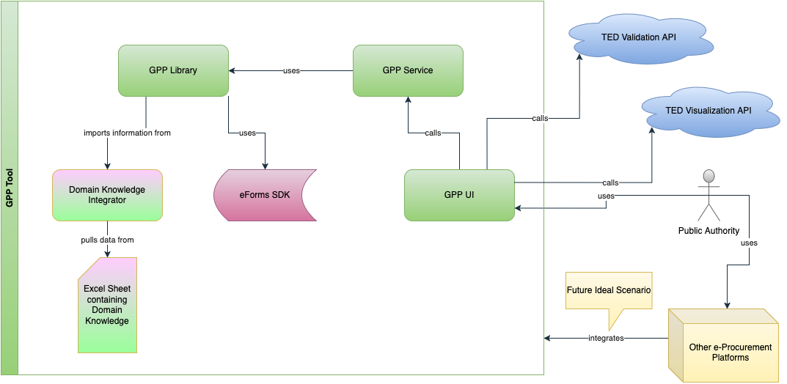

# eForms GPP Library

[](https://openjdk.java.net/projects/jdk/21/)
[](https://maven.apache.org/)
[](#license)

A Java library that can identify **Green Public Procurement (GPP)** criteria and apply the necessary modificatins to eForm contract notices.
The goal is to facilitate the use of GPP in digital procurement in Europe.

For examples on usage of this library, please look at the [GPP Service](https://github.com/uritrejo/eforms-gpp-service) and the [GPP UI](https://github.com/uritrejo/eforms-gpp-ui)

## High-level architecture diagram of solution surrounding the GPP Library



## 🌱 What is Green Public Procurement?

Green Public Procurement (GPP) is a process whereby public authorities seek to procure goods, services, and works with a reduced environmental impact throughout their life cycle. This library helps transform standard procurement notices into environmentally conscious ones by:

-   Analyzing procurement content using **CPV codes** (Common Procurement Vocabulary)
-   Identifying relevant **GPP criteria**
-   Suggesting concrete improvements and patches
-   Automatically applying environmental enhancements to notices

## ✨ Key Features

-   📄 **eForms Standard Support** - Load and parse procurement notices from XML (eForms standard)
-   🔍 **Analysis** - Analyze notices to identify relevant GPP criteria based on CPV codes and procurement categories
-   🌿 **Environmental Enhancement** - Suggest improvements and patches for better environmental sustainability indicators
-   🔧 **Automated Patching** - Apply patches to integrate the GPP indicators directly into the notices
-   📚 **Comprehensive Knowledge Base** - Domain knowledge management for GPP documents, criteria, and patches
-   🎯 **Ambition Levels** - Support for Core and Comprehensive GPP criteria levels

## 🚀 Quick Start

### Prerequisites

-   Java 21 or higher
-   Maven 3.6 or higher

### Installation

Add the library to your Maven project:

```xml
<dependency>
    <groupId>it.polimi.gpplib</groupId>
    <artifactId>eforms-gpp-library</artifactId>
    <version>1.0-SNAPSHOT</version>
</dependency>
```

### Basic Usage

```java
import it.polimi.gpplib.*;
import it.polimi.gpplib.model.*;

// Create analyzer with default configuration
GppNoticeAnalyzer analyzer = new DefaultGppNoticeAnalyzer();

// Load a procurement notice from XML
String noticeXml = XmlUtils.getAsXmlString("path/to/notice.xml");
Notice notice = analyzer.loadNotice(noticeXml);

// Analyze the notice
GppAnalysisResult result = analyzer.analyzeNotice(notice);
System.out.println("Found " + result.getRelevantGppDocuments().size() + " relevant GPP documents");
System.out.println("Suggested " + result.getSuggestedGppCriteria().size() + " GPP criteria");

// Get specific patches to improve environmental compliance
List<SuggestedGppPatch> patches = analyzer.suggestPatches(notice, result.getSuggestedCriteria());
System.out.println("Generated " + patches.size() + " improvement patches");

// Apply patches to create an enhanced, environmentally-conscious notice
Notice enhancedNotice = analyzer.applyPatches(notice, patches);

// Export the improved notice
String enhancedXml = enhancedNotice.toXmlString();
Files.writeString(Paths.get("enhanced_notice.xml"), enhancedXml);
```

### Advanced Configuration

```java
// Use custom domain knowledge files
GppNoticeAnalyzer customAnalyzer = new DefaultGppNoticeAnalyzer(
    "path/to/gpp_documents.json",
    "path/to/gpp_criteria.json",
    "path/to/gpp_patches.json"
);
```

## 📊 How It Works

### 1. Notice Analysis

The library examines procurement notices and extracts:

-   **CPV codes** (Common Procurement Vocabulary) for categorization
-   **Lot structure** for multi-lot procurements
-   **Procurement project details**

### 2. GPP Matching

Based on CPV codes, the system:

-   Identifies relevant **EU GPP documents** (e.g., "EU GPP Criteria for Furniture")
-   Matches **GPP criteria** appropriate for the procurement category
-   Considers **ambition levels** (Core vs Comprehensive)

### 3. Enhancement Suggestions

The library generates:

-   **Technical specifications** for environmental requirements
-   **Award criteria** for environmental performance evaluation
-   **Selection criteria** for vendor environmental capabilities
-   **Contract performance clauses** for ongoing environmental compliance
-   **Strategic procurement indicators** to indicate the usage of GPP criteria and sustainable procurement practices.

### 4. Automated Patching

Patches can be applied directly onto the eForm notice.

## 🛠️ Development

### Building the Project

```bash
# Compile the project
mvn compile

# Run all tests
mvn test

# Build JAR file
mvn package

# Generate complete documentation
mvn site
```

### Generate Documentation

```bash
# Generate JavaDoc API documentation
mvn javadoc:javadoc

# View documentation
open target/site/apidocs/index.html
```

### Run Tests

```bash
# Run unit tests with coverage
mvn clean test

# View coverage report
open target/site/jacoco/index.html
```

## 📚 Domain Knowledge

The library includes comprehensive domain knowledge management that bridges GPP expertise with the technical system. The domain knowledge covers:

-   **🇪🇺 EU GPP Criteria** - Official European Union Green Public Procurement criteria
-   **📄 GPP Documents** - Metadata and references to source documents
-   **🔧 eForm Field Mappings** - Technical mappings for integrating GPP data into eForms

For detailed information about domain knowledge structure, management, and contribution guidelines, see the [Domain Knowledge Documentation](domain_knowledge/README.md).

### Supported Procurement Categories

The library currently supports GPP enhancement for various procurement categories including:

-   Furniture and refurbishment services
-   Indoor cleaning services
-   Computers, monitors, tablets and smartphones
-   And more categories as defined in the domain knowledge base

The system uses CPV codes to automatically identify relevant GPP criteria for each procurement category.

## 🤝 Contributing

### Development Setup

1. Fork the repository
2. Create a feature branch: `git checkout -b feature/amazing-feature`
3. Make your changes and add tests
4. Ensure all tests pass: `mvn test`
5. Commit your changes: `git commit -m 'Add amazing feature'`
6. Push to the branch: `git push origin feature/amazing-feature`
7. Open a Pull Request

## 🔧 Configuration

### Ambition Levels

The library supports different ambition levels for GPP criteria:

-   **Core** - Basic environmental requirements suitable for most procurements
-   **Comprehensive** - Advanced environmental requirements for ambitious green procurement

## 📄 License

This project is licensed under the MIT License - see the [LICENSE](LICENSE) file for details.

## 🎓 Academic Context

This library was developed as part of research at **Politecnico di Milano** focusing on the digitalization and automation of Green Public Procurement processes. It aims to bridge the gap between environmental policy and practical procurement implementation.

_Making public procurement greener, one notice at a time_ 🌱
